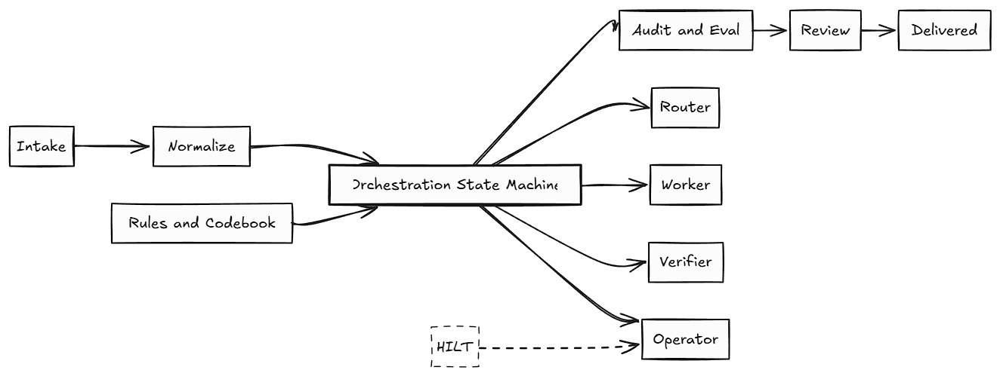

# Tiny CEDX Agent Fleet — Healthcare Administration (RCM)

An AI-orchestrated Revenue Cycle Management pipeline built as a **multi-agent fleet**
(Orchestrator + Router + Worker + Verifier + Operator). It runs end-to-end with one
command, survives injected data- and agent-level failures, is fully traceable, and
is cheap by design. The "agent" is an orchestrator of APIs, rules, an LLM, human
approvals, retries and audit — not a chatbot.



*End-to-end flow: the 5 governed stages across the top, the Orchestrator / Worker /
Verifier / Operator agents, the exception queue, and the cross-cutting router, audit
hash-chain and replay. Details in [ARCHITECTURE.md](ARCHITECTURE.md).*

---

## 1. Industry & Scope
- **Industry:** Healthcare Administration — AI-orchestrated Revenue Cycle Management (RCM).
- **Tier:** Mid-market hospital / physician-group RCM.
- **CASE_ID:** `CEDX-DEMO1` (placeholder — pass your live id via `CASE_ID=`).
- **Flow:** patient encounter/charge intake → data normalization → AI-assisted coding
  (charge capture, medical coding, CDI, medical-necessity) → deterministic decision
  points → claim assembly (837) + scrubber → human approvals → delivery + audit →
  exception handling. See `ARCHITECTURE.md`.

## 2. Agent topology (roster + contracts + file pointers)
| Agent | role | contract (in → out) | can_call | file |
|---|---|---|---|---|
| **Orchestrator** | orchestrator | NormalizedRecord → RecordResult | Router, CodingWorker, Verifier, Operator | `fleet/agents/orchestrator.py` |
| **Router** | router | NormalizedRecord → RouteDecision | — | `fleet/agents/router.py` |
| **CodingWorker** | worker | NormalizedRecord → WorkerDraft (**LLM, load-bearing**) | — | `fleet/agents/worker.py` |
| **Verifier** | verifier | WorkerDraft → VerifierVerdict (**overrules Worker**) | — | `fleet/agents/verifier.py` |
| **Operator** | operator | WorkerDraft → ApprovalState | — | `fleet/agents/operator.py` |

Typed events/contracts: `fleet/events.py`. Roster is emitted to `out/audit.json → agents`.

**Shape:** hub-and-spoke (mediator), **not** a linear agent chain. The Orchestrator is
the only agent with a non-empty `can_call`; the spokes never call each other. Per record
the control flow has a **feedback loop** (Worker → Verifier → *escalate & retry* → Worker)
and **conditional routing** (deliver / abstain / retry / exception), so it is not a
straight pipeline. See `ARCHITECTURE.md §2`. The 5 *stages* below are the linear happy path.

## 3. How to Run
Requires Python 3.11 + `pip install -r requirements.txt` (jsonschema, pypdf). Outputs:
`out/rcm_claim_batch.json`, `out/audit.json`, `out/exception_queue.json`.

**Docker — one command (what the grader runs; linux/amd64, installs everything):**
```bash
CASE_ID=CEDX-DEMO1 docker compose up --build     # runs `make demo && make verify`
```

**Linux / macOS (make):**
```bash
pip install -r requirements.txt
CASE_ID=CEDX-DEMO1 make demo && make verify
```

**Windows PowerShell (no `make` needed — call the module directly):**
```powershell
pip install -r requirements.txt
$env:CASE_ID="CEDX-DEMO1"; $env:SEED_DIR="seed"
python -m fleet.cli demo
python verify_audit.py --audit out/audit.json --transcripts transcripts --schema audit.schema.json
```
Every `make <target>` maps 1:1 to `python -m fleet.cli <target>` (with `ID=<id>` passed
as a trailing arg), so on any platform without `make` you can run, e.g.:
`python -m fleet.cli trace REC-020`, `python -m fleet.cli eval`,
`python -m fleet.cli probe-agent-failure`, `python -m fleet.cli replay REC-016`, etc.
(`verify` is the one exception: run the `verify_audit.py` line shown above.)

**Real-LLM path (held-out generalization; free tiers fine):**
```bash
REPLAY_LLM=false LLM_API_KEY=sk-... LLM_MODEL=gpt-4o-mini make demo   # or python -m fleet.cli demo
```
> Note: if `verify` prints `WARN: jsonschema not installed; skipping schema validation`,
> run `pip install -r requirements.txt` — the schema-conformance check (gate #1) only runs
> when `jsonschema` is present. The Docker path installs it automatically.

## 4. Controls (probe CLI — all exit 0)
| Command | Proves |
|---|---|
| `make demo` | full fleet on `$SEED_DIR`, writes package + audit + exception queue |
| `make verify` | `verify_audit.py` PASS on `out/audit.json` |
| `make trace ID=REC-020` | full agent decision path (Verifier overrules Worker, feedback, recovery) |
| `make replay ID=REC-016` | data lineage from the log alone |
| `make verify-replay` | delivered outputs reproduced **byte-for-byte from transcripts alone** |
| `make eval` | 17 golden cases + LLM-judge per agent, per-agent scores |
| `make review ARGS="REC-012 edit-resolve dr.reyes amount 5200"` | Operator surface: approve/reject/request-changes/edit-resolve (maker≠checker, before/after audit) |
| `make demo-alt` | **same fleet on a different vertical** (freight invoicing) — generalization proof |
| `make probe-approval` | non-approved / amendment-missing item refused + logged |
| `make probe-agent-failure` | Verifier catches AGENT_HALLUCINATION, routes, not delivered |
| `make probe-budget` | BUDGET_EXCEEDED raised + handled, never silent overspend |
| `make probe-append-only` | mutation AND deletion of a past audit entry refused |
| `make probe-idempotency` | run twice → byte-identical, no duplicates |
| `make probe-crash` (bonus) | re-run after a killed write re-converges |

No `make`? Each row is `python -m fleet.cli <target>` (append `<id>` for trace/replay),
except `verify` → the `verify_audit.py` command in §3.

## 5. Planted-problem handling
**Data layer (Class-A, blocking — routed, never delivered):**
`STALE` REC-011 · `MISSING_INPUT` REC-012 · `OUTLIER` REC-013 (robust MAD) ·
`INJECTION_BLOCKED` REC-014 · `LOW_CONFIDENCE` REC-015 (Worker abstains) ·
`UNVERIFIED_ANOMALY` REC-021 (unknown category), REC-022 (unverifiable figure).
**Class-B (auto-resolved + logged, delivered):** `SCHEMA_DRIFT` REC-016 (`Value`→`amount`) ·
`SUPERSEDED_VERSION` REC-017 (v1 superseded, v2 delivered).
**Agent layer:** `AGENT_HALLUCINATION` (Verifier overrules ungrounded output — sample
recovers on REC-020; persistent case in `probe-agent-failure`), `AGENT_MALFORMED`
(empty/invalid draft → bounded retry → abstain), `AGENT_LOOP` (step-cap kill),
`BUDGET_EXCEEDED` (cost/step ceiling). **Records delivered:** REC-001..010, 016, 017,
018, 019, 020 (15). **Routed to exception:** REC-011,012,013,014,015,021,022 (7).

## 6. Generalization
No IDs/values are hardcoded. Detectors are rule-based: outlier = per-batch median+MAD;
stale = `deadline < PIPELINE_NOW`; injection = pattern set; abstain = Worker confidence
floor; schema drift = declarative `field_map.json`; the `UNVERIFIED_ANOMALY` catch-all
absorbs unknown anomalies. Field renames map by alias, not by name.

**Proof it's structural, not RCM-worded:** all domain-specific knowledge (the coding
codebook + valid category set) lives in `domain_config.json`. `make demo-alt` runs the
**identical fleet** on a completely different vertical — *freight-invoice auditing*
(`domain_config.alt.json` + `seed_alt/`, renamed `invoice_total` field, non-RCM
categories/codes) — and passes the same gate with all reason codes. Swapping the config
+ seed is the only change; no pipeline code moves. The held-out seed
(different values, renamed fields, unseen anomaly, injected agent failures) exercises
the same code paths; the real-LLM path proves the Worker is load-bearing and the
Verifier catches agent misbehaviour on unseen data.

## 7. LLM/agent contract & eval
- `REPLAY_LLM=true` (default): only the model call is replayed from committed
  `transcripts/` keyed by canonical request hash and tagged with the calling agent;
  everything else is real code. `REPLAY_LLM=false`: OpenAI-compatible call
  (`gpt-4o-mini`/`claude-3-5-haiku`/`gemini-1.5-flash`) recorded in the same shape.
- `make eval`: ≥10 golden cases across all 5 agents + an LLM-judge per agent
  (rubric-scored, replayable). Regenerate transcripts with `make transcripts`.

## 8. Cost & scale
- **total $0.0098/run · avg $0.00045/record · p95 ≈ 120 ms/record.**
- Router: 15 cheap + 2 strong worker calls on the dev seed.
- **Projected: $4.47 per 10,000 records/day.** Ceilings: $0.05 & 8 steps per record.
- First bottleneck at 10k/day: the single-file audit → append-only event store (see DECISIONS.md).

## 9. Amendment
`H=sha256(CASE_ID)`; `R=roles[int(H[0],16)%4]`; `T=10000+(int(H[1:3],16)%50)*1000`.
`CEDX-DEMO1 → finance_controller @ 14000`. Printed at startup
(`AMENDMENT: role=... threshold=...`), stored under `amendment` in `out/audit.json`,
and enforced: any record with normalized amount ≥ T needs a recorded approval by role
R **in addition** to the normal chain, or delivery is refused (`make probe-approval`).

## 10. AI usage / real-vs-faked
AI assistants wrote most of the code; the architecture, contracts and governance are
the point. The LLM is load-bearing exactly once (the Worker's coding draft) and is
independently grounded by a deterministic Verifier — every delivered field hashes back
to a Worker transcript (`verify_audit.py` checks #8/#13/#14). Nothing else is faked:
intake, normalization, rules, routing, budgets, the approval state machine and the
audit are all real code, not prompts.

## 11. Tradeoffs & next week
- **Now:** file-based audit; synchronous processing; codebook is a small fixed map.
- **Next:** append-only event store + sharded queue consumers for 10k/day; richer
  clearinghouse (837/277CA/835) adapters; a Redactor agent for PII before delivery;
  two-pass Verifier for high-value claims. The typed-contract + event-bus design makes
  each a localized change (proven by the live-extension readiness below).

### Live-extension readiness (where each likely ask plugs in)
- **Add a 4th agent (e.g. Redactor):** new `fleet/agents/redactor.py` with an `AgentSpec`
  (`role: other`, `can_call: []`); Orchestrator adds it to `can_call` and calls it in
  `_deliver()` before `build_delivered_fields`; it emits its own `agent_trace` span. No
  other file changes.
- **New reason code + detector:** add a `detect_*` to `fleet/rules.py` and one enum entry;
  it routes through the existing exception path automatically.
- **Change the router policy / move the cost number:** edit `fleet/agents/router.py`
  signals; `make demo` reprints avg/$record and 10k projection.
- **Two independent Verifier passes for high-value records:** the Verifier is already an
  isolated unit invoked by the Orchestrator — wrap the call in `process()` in a 2-of-2
  consensus for `amount >= T`.
- **Iterative Worker↔Verifier collaboration** is already implemented: on a rejection the
  Verifier's disagreements are fed back into the Worker's next prompt (see
  `feedback_to_worker` events and `make trace ID=REC-020`).
